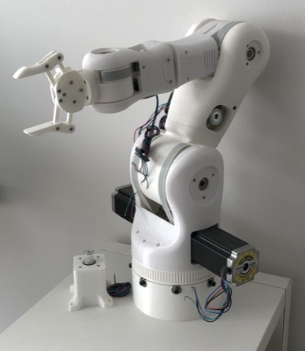

# BCN3D-MOVEO
### Implementation of the [BCN3D MOVEO](https://www.bcn3d.com/bcn3d-moveo-the-future-of-learning-robotic-arm/): A fully Open Source 3D printed robot arm

I used an [Ender 5 Pro 3D-printer](https://www.creality3dofficial.com/de/products/ender-5-pro-3d-printer)
to print out all of the provided STL files. Since, not all of the required, non-printable parts (motors, controlers, etc.)
are accurately described in the original BOM, I extended on the more accurate BOM of [BradyHooverDesigns](https://github.com/BradyHooverDesigns/BCN3D-MOVEO-BOM), 
which I added to this repo. Assembling all of the parts comes with its own set of challenges, which is why, besides the original 
User Manual, I used the comprehensive assembly videos of [Toglefritz](https://www.instructables.com/Build-a-Giant-3D-Printed-Robot-Arm/).

### This is the current state of the robot:

### TODO:

- [x] Print STL files
- [x] Buy non-printable parts (motors, controlers, etc.)
- [x] Assemble the robot
- [ ] Wire the robot
- [ ] Boot with firmware (controlers, Arduino)
- [ ] Setup [Control Platform](https://www.jesseweisberg.com/moveo-with-ros) by Jesse Weisberg
- [ ] Have fun!

> Feel free to get in contact with me if you have any questions or suggestions. Unfortunately, the project
is currently on hold, since I should focus on my studies :P

